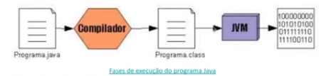

#Introdução ao Ecossistema e Documentação Java

## Início do JAVA
Interessada em dispositivos eletrônicos inteligentes, a Sun Microsystems financiou uma pesquisa interna com o codinome Green. O projeto resultou no desenvolvimento de uma linguagem de programação baseada em C e C++, cujo o criador James Gosling, a chamou de OAK (carvalho) em homenagem a uma árvore  que estava em frente a sua janela do escritório na Sun.

Hoje a linguagem de programação JAVA é mantida pela Oracle Inc.

## Programação Orientado a Objetos
Um objeto é uma absttração do mundo real, composto por um identificador (nome), atributos (propriedades) e métodos (comportamentos) definidos em uma classe.

* Instanciar (new)
	É o ato de criar um objeto a partir de estrutura definida em uma classe
    
* Comportamentos (behavior)
	Também conhecido como ações ou métodos, é toda parte comportamental que um objeto dispõe.
    
* Características (states)
	Também conhecido como atributos ou propriedades, é toda informação que representa o estado do objeto
    
* Identificador (identity)
	Propósito existencial aos objetos que serão criados
    
* Classe (class)
	A estrutura e/ou representação que direciona a criação dos objetos de mesmo tipo

Quando falamos em programar em JAVA devemos  dominar além dos fundamentos da linguagem, um conjunto de ferramentas e frameworks exclusivos.

Abaixo segue lista de tecnologias que iremos utilizar:

* Java JDK
	Kit de ferramentas para desenvolvimento na linguagem.
    
* Eclipse IDE
	Programa para edição, depuração, compilação, testes e execução de programas JAVA.
    
* Hibernate
	Framework baseado no conceito de ORM para a persistência de dados em um banco relacional.
    
* Spring Framework
	Plataforma para desenvolvimento de aplicações JAVA baseado nos padrões de projeto de inversão de controle e injeção de dependências.
    
    Sua estrutura é composta por módulos afins de reduzir a complexidade no desenvolvimento de aplicações.
    
* Postgres
	Banco de dados relacional.
* Swagger
	Ferramenta de documentação de APIs e Webservices.
* Github
	Repositório e gerenciador de versionamento de códigos.
* Maven
	Sistema para gestão de dependência e distribuição de uma aplicação.
* REST
	Arquitetura para transferência de dados representativos como JSON.
* Heroku
	Plataforma para hospedagem de aplicações com fácil integração com Github.
    
##Características da linguagem JAVA:

- Compilada

	Diferença do JAVA para as outras linguagens:
	
		Nas outras linguagens deve se criar uma compilação para cada Sistema Operacional.
		
		No JAVA a compilação criará um executável .class e cada Sistema Operacional
		terá a sua JVM, responsável pela tradução do código.

- Interpretada

- Fortemente tipada

- Linguagem de alto nível

	Orientada a objetos

- Executada em uma máquina virtual - JVM (Java Virtual Machine)

	Máquina virtual responsável pela tradução do BytesCodes oriundos 
	do compilador JAVAC (JAVA Compiler) em código de máquina de cada sistema.

					Compilação							Interpreção
Source File (.java) 	--> 	Bytecodes (.class) 			--> 		JAVA (JVM)

	Características:
		
		Execução de pilhas
		Gerenciamento de memória
		Gerenciamento de threads
		Otimização de código (Compilação  JIT - Just in Time)
		Garbage Collector (GC)
			Responsável pela limpeza da memória suja.
		
		
##Diferença entree JRE e JDK:

	JRE (JAVA Runtime Environment) 
		Responsável pela execução dos programas JAVA. Aqui estão as bibliotecas padrão do JAVA, utilizadas na compilação do código-fonte. O JVM, responsável pela execução do bytecode está incluido no JRE.
        Para rodar o programa na sua máquina basta ter apenas o JRE.
		
	JDK (JAVA Development Kit)
		Utilitário que permite o desenvolvimento de programas em JAVA e
		já possui o JVM para execução dos programas. 
        Kit de Desenvolvimento JAVA responsável por compilar código-fonte (.java) em bytecode (.class)
		
Tipos de plataformas JAVA:

JAVA SE (JAVA Standard Edition)
	Contém as especificações do JAVA e pode ser
	implementado por diversas empresas.

JAVA EE (JAVA Enterprise Edition)
	Contém  todas as implementações do JAVA SE e 
	um número de programas úteis para que executam em
	servidores. (Renomeada para Jakarta EE)

JAVA ME (JAVA Micro Edition)
	Contém especificações para desenvolvimento de 
	programas para dispositivos pequenos como celulares,
	PDA's entre outros.
		
##Fases da Execução JAVA
	1. Escrevemos o código-fonte (.java)
	2. Utilizamos o JDK para compilar o código-fonte e gerar o arquivo bytecode (.class)
	3. Para executar o seu programa, a JVM lé o arquivo compilado e as bibliotecas padrões do JAVA que estão no JRE

    
Palavras Reservadas
	Como todas as linguagens de programação exitem algumas palavras
	que são reservadas ao JAVA e não podem ser definidas para dar um
	nome a classe, método, variável, etc...

## Versões do JAVA
###OpenJDK
	Java totalmente open source com uma GNU.
### JDK Oracle
	Requer uma licença comercial sob contrato de licença de código binário Oracle.

## Instalação JAVA
	Verificar se o JAVA está instalado na máquina:
   		java --version
        
    Baixar JDK e instalar no equipamento
    
    Adicionar a variável de ambiente JAVA_HOME, informando o diretório de instalação do JDK
    
    Alterar a variável de ambiente PATH, adicionando o diretório de instalação do JDK
    
    via CMD, set JAVA_HOME
    
    via CMD, set PATH
    
    java --version, mostrará a versão do JAVA instalada no equipamento
    
Declaração de Classes

	   
	public class Order {
		// public --> modificador de acesso
		// class --> palavra reservada para definição de classe
		// <Nome> --> nome da classe representa o objeto iniciando com letra maiúscula
	
		//atributos
		private final String code;
		private final BigDecimal totalValue;
		
		//metodo
		public BigDecimal calculateFee() {
		
		}
	}

Modificadores de Acesso

	public
		Qualquer classe de qualquer pacote poderá acessar o 
		atributo ou método.
	
	protected
		Qualquer classe definida no mesmo pacote ou subclasse.
	
	Sem modificador
		Apenas classes definidas no mesmo pacote.
		
	

Métodos
	São funções que definem o comportamento de uma classe.
	
	Tipos de métodos:
	
		Contrutores
			Definenm como uma classe será instanciada "construída".
			
		Comum
			Definem comportamentos que podem ou não estar atribuídas
			às regras de negócio.
			
			Exemplo: calcular taxas de um pedido, etc...
			
		
Estrutura de Condição
	Responsável por fazer o desvio do fluxo de execução do código
	de acordo com uma condição.
	
	Tipos de estruturas de condição:
	
	if - else
		// metodo
		public double calculateFee() {
		
			if(this.totalValue > 100) {
				return this.totalValue * 0.99;				
			} else {
				return this.totalValue;
			}
			
		}
		
	switch - case
	
		public double calculateFee() {
		
			switch (this.totalValue) {
				case 100:
					return totalValue * 0.99;
				case 200:
					return totalValue * 1.99;
				default:
					return totalValue;				
			}
		}
	
Estrutura de Repetição
	Responsável por executar repetidamente uma instrução ou um
	bloco de instruções, até uma condição estiver sendo satisfeita.
	
	Tipos de estruturas de repetição:

	while
	
		public void printItens() {
		
			int i = 0;
				
			while (i < itens.length) {
				
				System.out.println(itens[i]);
				i++;
				
			}
				
		}
	
	do - while

		public void printItens() {
		
			int i = 0;
				
			do {
				
				System.out.println(itens[i]);
				i++;
				
			} while (i < itens.length)
				
		}
	
	
	for
	
		public void printItens() {

			for (int i = 0; i < itens.length; i++) {

				System.out.println(itens[i]);

			}
		}
		
	enhanced for
	
		public void printItens() {
	
			for (String i : itens) {
			
				System.out.println(i);

			}
		}

Comentário JAVA
---------------
	// Comentário em linha
    
    /**
    	*Comentário em 
    	*bloco
    */
    
JAVADOC
-------

	Ferramenta para documentação no formato HTML que se baseia nos comentários do código fonte.

	Os comentários precisam conter tags para que a documentação fique legível.
    
    TAGS 
    
    	@author - Especifica o autor da classe/método
        
        @deprecated - Identifica classes/métodos obsoletos
        
        @link - Possibilita a definição de um link para um outro documento local ou remoto através de URL
        
        @param - Descreve um parâmetro que será passado a um método
        
        @return - Descreve qual o tipo de retorno de um método
        
        @see - Associa a outras classes ou métodos
        
        @since - Descreve desde de quando uma classe ou métodos foi adicionado
        
        @throws - Descreve os tipos de exceções que podem ser lançadas por um método
        
        @version - Descreve a versão da classe/método
       
##Tipos Profissionais JAVA
Full Stack "Pilha Cheia"

	- Programador Back-end
    	Responsável pela camada que fica atrás da interação com o usuário, como acesso as regras de negócio, banco de dados, etc...
        Também denominado Server Side (lado do Servidor) é responsável por disponibilizar os seguintes recursos:
        
        Regra de Negócio
        Acesso a dados
        Segurança
        Integração via APIs / Web Service
        
        Este profissional precisa conhecer uma ou mais linguagem de programação e banco de dados disponíveis na empresa.
        
    - Programador Front-end
		Diretamente ligado ao desenvolvimento da interface de tela do usuário com o sistema.
        
    	Deve pensar nos requisitos para o desenvolvimento de qualquer aplicação que necessite interação do usuário, como:
        
        Aparência
        Usabilidade
        Objetivo
        Segurança
        
        Comsposto por uma linguage de programação a Java Script e tecnologias complementares que são conhecidas como: Hypertextos, Gerador de estilos, Bibliotecas ou Frameworks.

    - Analista de Banco de Dados
    - Analista de Infraestrutura (DevOps)

	Este profissional deve dominar cada uma destas etapas acima. Para diminuir o tempo de compreensão do projeto e depender pouco de outras áreas.
    
## Tecnologia

	- HTML
    	Linguagem de marcação de hypertexto
        
	- CSS
		Linguagem de estilização de conteúdo HTML
        
	- Bootstrap
		Biblioteca de estilos CSS pré-definidos, criado pelo Twitter
        
	- JQuery
		Biblioteca Javascript muito utilizada antes da era das aplicações SPA
        
    - Node JS
    	Plataforma capaz de executar códigos JavaScript fora de um navegador web
        
    - VueJS
    	Framework JavaScript de código-aberto, focado no desenvolvimento de interfaces de usuário e aplicativos de página única.
        
    - React
		Mesma proposta do VueJS com suas particularidades

	- Angular
		Mesma proposta do VueJS com suas particularidades
        
    - TypeScript
    	Linguagem de programação desenvolvida pela Microsoft, com superconjunto sintático e estrito de JavaScript e adiciona tipagem estática opcional à linguagem
        
##Conceitos Importantes
* API 
	Significa interface de programação de aplicações, um conjunto de definições e protocolos para criar e integrar softwares de aplicações.
    
* Autowired
	Um recurso em forma de anotação(indicação) onde deverá ocorrer uma injeção automática de dependência.

* Beans
	Objeto que é instanciado(criado), montado e gerenciado por um container através do princípio da inversão de controle.
    

* JSON
	Significa JavaScript Object Notation, é uma formatação utilizada para estruturar dados em formato de texto e transmiti-los de um sistema para outro, como em aplicações cliente-servidor ou em aplicativos móveis.
    
* MVC
	Sigla do termo em inglês Model (modelo) View (visão) e Controller (Controle) que facilita a troca de informações entre a interface do usuário aos dados no banco, fazendo com que as respostas sejam mais rápidas e dinâmicas.
    
* ORM
	Object-Relational Mapping (ORM), em português, mapeamento objeto-relacional, é uma técnica para aproximar o paradigma de desenvolvimento de aplicações orientadas a objetos ao paradigma do banco de dados relacional.
    
* Scopes
	Controle da existência de nossos objetos Components da aplicação em uma esfera de utilização: Singleton, Propotype, Reques, Session, Global.

##Comunidade JAVA
---------------
[OpenSanca](opensanca.com.br)
    
[SouJava](soujava.org.br)

[DevOpsPBS](devopspbs.org)
    

##Referências
	Dio.me Bootcamp - GFT Start #4 Java
    
#Variáveis, Tipos de Dados e Operadores Matemáticos em Java
 

